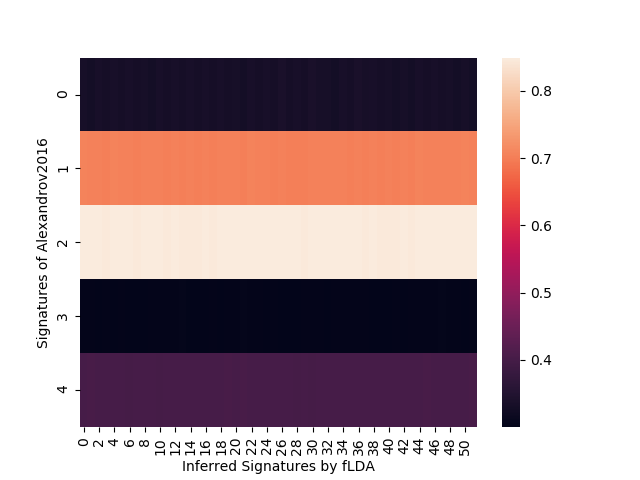
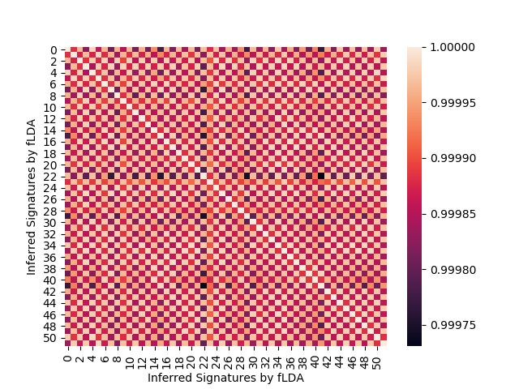
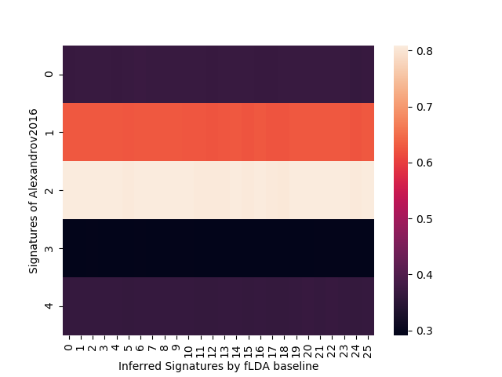

# Research Project CMSC828P - Extracting signatures using f-LDA

**Author**: Qingyang Tan ([qytan@cs.umd.edu](mailto:qytan@cs.umd.edu))
**Date**: December 6, 2018

## Plan of investigation

Some factors like smoking history, age, gender would impact the mutation processes in cancer, as shown in Alexandrov, et al. [1]. We want to use facotrial LDA (f-LDA) (Paul, et al. [2]) to extract mutation signatures, hoping the model could consider the impact of these factors. Meanwhile, after training f-LDA, we can directly infer the influences of different factors over mutation signatures from the results. In the following sections, we will give more details about f-LDA, data we used and planned experiments.

### Factorial LDA (f-LDA) overview

According to Paul, et al. [2], factorial LDA is a multi-dimensional model in which a document is influenced by K different factors, and each word token depends on a K-dimensional vector of latent variables. Here is a figure shown f-LDA as a graphical model:

Since f-LDA has several different factors (i.e. [Z1, Z2, Z3, Z4, ..., ZK]), we can consider different factors as base signatures, smoker vs non-smoker, alcohol user vs non-alcohol user, female vs male and so on. Notice that, f-LDA is pure unsupervised learning, thus we need to check the meaning of different factors manually after training. 

Meanwhile, if we train f-LDA only using 1 factor, the results would be similar with vanilla LDA. Though, f-LDA would learn a unified background topic, and would have sparsity over different topics. We think that, sparsity may help prune redundant topics in this case, and reduce the need of model selection.

We can use prior ω over word distribution Φ to get mutation signatures. (In current f-LDA implementation, word assignments are generated from the prior. Thus, extracting signatures from assignments would have a similar results as directly checking the prior.) The following is the formulation of the prior:

The parameters of the prior is all learnt by the algorithm. We can interpret ω(0) as one unified background signature, ω(1) as base signatures, ω(i) with i>1 as influences of different factors over the first level base signatures.

### Experiment

We use datasets form Alexandrov, et al. [1] to perform main experiments. This dataset has smoking/drinking histories, gender and age information. We plan to compute perplexity of f-LDA considering several factors, compared with baseline 1-factor f-LDA. We also want to use probabilities of different topics to predict smoking history.

### Data, resources, and implementation

* The data for this experiment is offered by course CMSC 828P in [UMIACS website](https://obj.umiacs.umd.edu/mutation-signature-explorer/index.html). This includes 9724 samples of base substitutions and related clinical information. We include the preprossed tsv file [here](../data/counts.Alexandrov2016.SBS-96.tsv).
* Alexandrov, et al. [1] released some of their signature extraction results in [Supplementary Table S6](../data/aag0299_Tables_S1_to_S6.xlsx).
* We transfer [code from f-LDA author](http://cmci.colorado.edu/~mpaul/downloads/flda.php) to Python.
* We write code to compare perplexity, signatures and classifcation results.

## Results

### Issues with current implementation
1. Counting the Gibbs sampling results in Python is very slow. For example, if we directly translate java code, we need to run 1 step on whole dataset of Alexandrov, et al. [1] for around 300 seconds. After doing some optimization, it still needs around 80 seconds. Thus, it’s hard to run many iterations.
2. Only updating α weights in one step (this is a common process in fitting on test data) will cause decrease in log-likelihood, it happens both in original Java version and Python version. It does not conform to the overall optimization goal. 

### Perplexity

In this experiment, we compare the testing perplexity generated by 1&2-factor f-LDA. Some parameters to carry out the experiment:

| Parameter | Setting |
| --- | --- |
| 1-factor f-LDA factors| [26] |
| 2-factor f-LDA factors| [26, 2] |
| Number of training samples| 6806 |
| Number of testing samples| 2918 |
| Training iterations| 250 |
| Fitting iterations | 100 |

Since Alexandrov, et al. 2016 extracted 26 signatures from the dataset, so we set the number of first level factors as 26. During the fitting on the testing set, we only update α(d,k), θ(d).

For 1-factor f-LDA, the perplexity is 22.404929; For 2-factor f-LDA, the result is 288.568757. It seems that 2-factor f-LDA do not improve the results.

### Signatures

In this experiment, we use same 1&2-factor f-LDA in previous experiment. We train for 400 iterations on the whole dataset from Alexandrov, et al. [1] (9724 samples). However, f-LDA seems not learn anything useful yet.

We compare the extracted signatures of 2-factor f-LDA with results from Alexandrov, et al. [1] and themselves:

When compared with themselves, the signatures look very similar to each other.

Similar results happen with 1-factor f-LDA:

### Classification

In this experiment, we try to predict smoker/non-smoker using the results of f-LDA. We also compare the results directly using mutation counts. We use [C-Support Vector Classification from sklearn](https://scikit-learn.org/stable/modules/generated/sklearn.svm.SVC.html#sklearn.svm.SVC). In the dataset of 
Alexandrov, et al. [1], it has 3087 samples with smoking history information. We split these samples into training set (2160 samples) and testing set (927 samples).

Here is the classifcation results of different inputs:

| Input | Accuracy |
| --- | --- |
| Mutation counts | 0.7389428263214671 |
| 2-factor f-LDA exposures | 0.7281553398058253 |
| 1-factor f-LDA exposures | 0.7281553398058253 |
| Mutation counts (with class balancing) | 0.7464940668824164 |
| 2-factor f-LDA exposures (with class balancing) | 0.27184466019417475 |
| 1-factor f-LDA exposures (with class balancing) | 0.27184466019417475 |

If we train SVM without class balancing, using exposures of f-LDA will predict all testing samples as smokers, while training with class balancing will predict all testing samples as non-smokers.

## Discussion
In sum, it’s not easy to use f-LDA to extract mutation signatures. And since f-LDA is pure unsupervised learning, we cannot ensure the meaning of different factors learned by the algorithm. If we want to improve the results, we hope we can check the correctness of updating α weights, optimize Gibbs sampling part in Python version and incorporate supervised learning with f-LDA.

## References
1. Alexandrov, et al. (2016) "Mutational signatures associated with tobacco smoking in human cancer." _Science_ 354(6312), pages 618-622. [doi: 10.1126/science.aag0299](https://doi.org/10.1126/science.aag0299)
2. Paul, et al. (2012) "Factorial LDA: Sparse Multi-Dimensional Text Models" _NIPS_