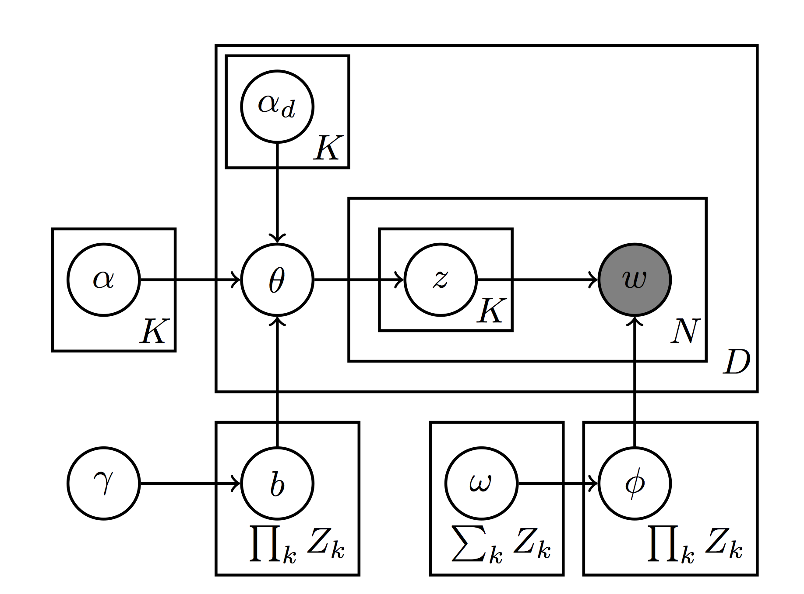

# Research Project CMSC828P - Extracting signatures using f-LDA

**Author**: Qingyang Tan ([qytan@cs.umd.edu](mailto:qytan@cs.umd.edu))
**Date**: December 6, 2018

## Plan of investigation

Some factors like smoking history, age, gender would impact the mutation processes in cancer, as shown in Alexandrov, et al. [1]. We want to use facotrial LDA (f-LDA) to extract mutation signatures, hoping the model could consider the impact of these factors. Paul, et al. [2]. Meanwhile, after training f-LDA, we can directly infer the influences of different factors over mutation signatures from the results. In the following section, we will give more details about f-LDA, data we used and planned experiments.

### Factorial LDA (f-LDA) overview

According to Paul, et al. [2], factorial LDA is a multi-dimensional model in which a document is influenced by K different factors, and each word token depends on a K-dimensional vector of latent variables. Here is a figure shown f-LDA as a graphical model:

Since f-LDA has several different factors (i.e. [Z1, Z2, Z3, Z4, ..., ZK]), we can consider different factors as base signatures, smoker vs non-smoker, alcohol user vs non-alcohol user, female vs male and so on. Notice that, f-LDA is pure unsupervised learning, thus we need to check the meaning of different factors manually after training. 

Meanwhile, if we train f-LDA only using 1 factor, the results would be similar with vanilla LDA. Though, f-LDA would learn a unified background topic, and would have sparsity over different topics. We think that, in this case, sparsity may prune redundant topics in this case, and reduce the need of model selection.

We can use prior $\omega$ over word distribution \phi to get mutation signatures. (In current f-LDA implementation, word assignments are generated from the prior. Thus, extracting signatures from assignments would have a similar results as directly checking the prior.)

#### Experiment

#### Data, resources, and implementation

#### Validation

## Results

## References
1. Alexandrov, et al. (2016) "Mutational signatures associated with tobacco smoking in human cancer." _Science_ 354(6312), pages 618-622. [doi: 10.1126/science.aag0299](https://doi.org/10.1126/science.aag0299)
2. Paul, et al. (2012) "Factorial LDA: Sparse Multi-Dimensional Text Models" _NIPS_